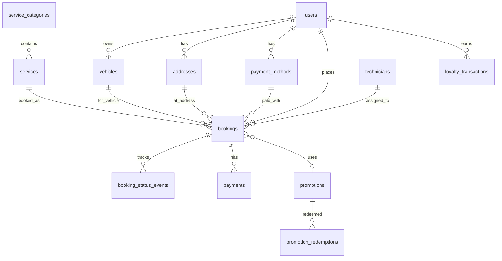

# 01 — مخطط قاعدة البيانات | Database Schema

منصة **روستو** (Rousto) — عناية ذكية بالسيارات عند موقع العميل.

- **قاعدة البيانات:** PostgreSQL 16+
- **الترميز:** UTF-8 (دعم العربية)
- **المعرّفات:** UUID v4
- **المنطقة الزمنية:** `Asia/Riyadh`

---

## مخطط العلاقات (ER)



---

## الجداول

### 1. `users` — المستخدمون

| العمود | النوع | الوصف |
|--------|-------|-------|
| `id` | UUID PK | المعرّف |
| `full_name` | VARCHAR(120) | الاسم الكامل |
| `email` | VARCHAR(255) UNIQUE | البريد |
| `phone` | VARCHAR(20) UNIQUE | الجوال (+966…) |
| `avatar_initials` | CHAR(1) | حرف الأفاتار |
| `loyalty_points` | INTEGER DEFAULT 0 | رصيد النقاط |
| `locale` | VARCHAR(5) DEFAULT 'ar' | اللغة |
| `is_active` | BOOLEAN DEFAULT true | نشط |
| `created_at` | TIMESTAMPTZ | تاريخ التسجيل |
| `updated_at` | TIMESTAMPTZ | آخر تحديث |

### 2. `vehicles` — المركبات

| العمود | النوع | الوصف |
|--------|-------|-------|
| `id` | UUID PK | |
| `user_id` | UUID FK → users | المالك |
| `make` | VARCHAR(60) | الشركة (تويوتا) |
| `model` | VARCHAR(60) | الموديل (كامري) |
| `year` | SMALLINT | سنة الصنع |
| `color` | VARCHAR(40) | اللون |
| `plate_number` | VARCHAR(20) | رقم اللوحة |
| `is_default` | BOOLEAN | المركبة الافتراضية |
| `created_at` | TIMESTAMPTZ | |

### 3. `service_categories` — تصنيفات الخدمات

| العمود | النوع | الوصف |
|--------|-------|-------|
| `id` | UUID PK | |
| `slug` | VARCHAR(40) UNIQUE | معرّف إنجليزي (oil, tires…) |
| `name_ar` | VARCHAR(80) | الاسم بالعربية |
| `sort_order` | SMALLINT | ترتيب العرض |
| `is_active` | BOOLEAN | |

### 4. `services` — الخدمات

| العمود | النوع | الوصف |
|--------|-------|-------|
| `id` | UUID PK | |
| `category_id` | UUID FK | التصنيف |
| `slug` | VARCHAR(60) UNIQUE | |
| `name_ar` | VARCHAR(120) | اسم الخدمة |
| `subtitle_ar` | VARCHAR(200) | وصف مختصر |
| `icon_key` | VARCHAR(40) | مفتاح الأيقونة (oil_barrel…) |
| `price_sar` | NUMERIC(10,2) | السعر بالدينار |
| `duration_minutes` | SMALLINT | المدة بالدقائق |
| `is_active` | BOOLEAN | |
| `created_at` | TIMESTAMPTZ | |

### 5. `addresses` — العناوين

| العمود | النوع | الوصف |
|--------|-------|-------|
| `id` | UUID PK | |
| `user_id` | UUID FK | |
| `label` | VARCHAR(40) | التسمية (المنزل، العمل) |
| `district` | VARCHAR(80) | الحي |
| `city` | VARCHAR(60) | المدينة |
| `latitude` | NUMERIC(10,7) | |
| `longitude` | NUMERIC(10,7) | |
| `is_default` | BOOLEAN | |
| `created_at` | TIMESTAMPTZ | |

### 6. `payment_methods` — طرق الدفع

| العمود | النوع | الوصف |
|--------|-------|-------|
| `id` | UUID PK | |
| `user_id` | UUID FK | |
| `type` | ENUM | mada, apple_pay, visa, mastercard |
| `last_four` | CHAR(4) | آخر 4 أرقام |
| `label_ar` | VARCHAR(60) | التسمية (مدى **** 4421) |
| `is_default` | BOOLEAN | |
| `created_at` | TIMESTAMPTZ | |

### 7. `technicians` — الفنيون

| العمود | النوع | الوصف |
|--------|-------|-------|
| `id` | UUID PK | |
| `full_name` | VARCHAR(120) | |
| `phone` | VARCHAR(20) | |
| `rating` | NUMERIC(2,1) | التقييم (4.9) |
| `avatar_initials` | CHAR(1) | |
| `is_available` | BOOLEAN | متاح للتعيين |
| `current_lat` | NUMERIC(10,7) | الموقع الحالي |
| `current_lng` | NUMERIC(10,7) | |
| `created_at` | TIMESTAMPTZ | |

### 8. `promotions` — العروض والخصومات

| العمود | النوع | الوصف |
|--------|-------|-------|
| `id` | UUID PK | |
| `code` | VARCHAR(30) UNIQUE | كود الخصم (ROUSTO) |
| `title_ar` | VARCHAR(120) | عنوان العرض |
| `description_ar` | VARCHAR(300) | |
| `discount_type` | ENUM | percentage, fixed_amount |
| `discount_value` | NUMERIC(10,2) | قيمة الخصم |
| `min_order_sar` | NUMERIC(10,2) | الحد الأدنى |
| `max_uses_per_user` | SMALLINT | |
| `starts_at` | TIMESTAMPTZ | |
| `ends_at` | TIMESTAMPTZ | |
| `is_active` | BOOLEAN | |

### 9. `bookings` — الحجوزات / الطلبات

| العمود | النوع | الوصف |
|--------|-------|-------|
| `id` | UUID PK | |
| `reference` | VARCHAR(12) UNIQUE | رقم مرجعي (RST-2026-001) |
| `user_id` | UUID FK | العميل |
| `service_id` | UUID FK | الخدمة |
| `vehicle_id` | UUID FK | المركبة |
| `address_id` | UUID FK | موقع الخدمة |
| `payment_method_id` | UUID FK | طريقة الدفع |
| `technician_id` | UUID FK NULL | الفني المعيّن |
| `promotion_id` | UUID FK NULL | العرض المطبّق |
| `scheduled_at` | TIMESTAMPTZ | موعد الخدمة |
| `service_price_sar` | NUMERIC(10,2) | سعر الخدمة |
| `discount_sar` | NUMERIC(10,2) | الخصم |
| `total_sar` | NUMERIC(10,2) | الإجمالي |
| `status` | ENUM | انظر أدناه |
| `notes` | TEXT | ملاحظات |
| `created_at` | TIMESTAMPTZ | |
| `updated_at` | TIMESTAMPTZ | |

**حالات الحجز (`booking_status`):**

| القيمة | الوصف |
|--------|-------|
| `pending` | بانتظار التأكيد |
| `confirmed` | تم تأكيد الحجز |
| `technician_assigned` | تم تعيين الفني |
| `en_route` | الفني في الطريق |
| `in_progress` | تنفيذ الخدمة |
| `completed` | اكتمال الخدمة |
| `cancelled` | ملغى |

### 10. `booking_status_events` — سجل تتبّع الحجز

| العمود | النوع | الوصف |
|--------|-------|-------|
| `id` | UUID PK | |
| `booking_id` | UUID FK | |
| `status` | booking_status | الحالة |
| `label_ar` | VARCHAR(120) | النص المعروض |
| `occurred_at` | TIMESTAMPTZ | وقت الحدث |
| `metadata` | JSONB | بيانات إضافية (ETA…) |

### 11. `payments` — المدفوعات

| العمود | النوع | الوصف |
|--------|-------|-------|
| `id` | UUID PK | |
| `booking_id` | UUID FK | |
| `amount_sar` | NUMERIC(10,2) | المبلغ |
| `status` | ENUM | pending, captured, refunded, failed |
| `gateway_ref` | VARCHAR(100) | مرجع بوابة الدفع |
| `paid_at` | TIMESTAMPTZ | |
| `created_at` | TIMESTAMPTZ | |

### 12. `loyalty_transactions` — حركات النقاط

| العمود | النوع | الوصف |
|--------|-------|-------|
| `id` | UUID PK | |
| `user_id` | UUID FK | |
| `booking_id` | UUID FK NULL | |
| `points` | INTEGER | موجب = كسب، سالب = استبدال |
| `reason_ar` | VARCHAR(200) | السبب |
| `created_at` | TIMESTAMPTZ | |

### 13. `testimonials` — آراء العملاء

| العمود | النوع | الوصف |
|--------|-------|-------|
| `id` | UUID PK | |
| `user_id` | UUID FK NULL | |
| `author_name` | VARCHAR(80) | |
| `city` | VARCHAR(60) | |
| `quote_ar` | TEXT | |
| `rating` | SMALLINT | 1–5 |
| `is_published` | BOOLEAN | |
| `created_at` | TIMESTAMPTZ | |

### 14. `vehicle_scans` — فحوصات الصور (AI)

| العمود | النوع | الوصف |
|--------|-------|-------|
| `id` | UUID PK | |
| `user_id` | UUID FK | المستخدم |
| `vehicle_id` | UUID FK | المركبة |
| `scan_type` | VARCHAR(40) | نوع الفحص |
| `status` | VARCHAR(20) | pending / completed / failed |
| `created_at` | TIMESTAMPTZ | |
| `completed_at` | TIMESTAMPTZ | |

### 15. `scan_images` — صور الفحص

| العمود | النوع | الوصف |
|--------|-------|-------|
| `id` | UUID PK | |
| `scan_id` | UUID FK | |
| `storage_key` | VARCHAR(255) | مسار التخزين |
| `mime_type` | VARCHAR(80) | |
| `sort_order` | SMALLINT | |

### 16. `scan_findings` — نتائج التشخيص

| العمود | النوع | الوصف |
|--------|-------|-------|
| `id` | UUID PK | |
| `scan_id` | UUID FK | |
| `code` | VARCHAR(60) | رمز النتيجة |
| `label_ar` | VARCHAR(200) | الوصف بالعربية |
| `severity` | VARCHAR(20) | low / medium / high |
| `confidence` | NUMERIC(4,3) | نسبة الثقة |
| `suggested_service_id` | UUID FK | خدمة مقترحة |

`bookings.scan_id` — ربط اختياري بالفحص (انظر [`06_AI_AND_IMAGE_RECOGNITION`](06_AI_AND_IMAGE_RECOGNITION.md)).

### 17. `technician_location_updates` — سجل مواقع الفني

| العمود | النوع | الوصف |
|--------|-------|-------|
| `id` | UUID PK | |
| `technician_id` | UUID FK | الفني |
| `booking_id` | UUID FK NULL | الحجز المرتبط |
| `lat` / `lng` | NUMERIC(10,7) | الإحداثيات |
| `recorded_at` | TIMESTAMPTZ | وقت التسجيل |

انظر [`07_LOGISTICS_AND_LAST_MILE`](07_LOGISTICS_AND_LAST_MILE.md).

### 18. `split_rules` — قواعد تقسيم المدفوعات

| العمود | النوع | الوصف |
|--------|-------|-------|
| `slug` | VARCHAR(40) | معرّف القاعدة |
| `platform_rate` | NUMERIC(5,4) | نسبة المنصة |
| `technician_rate` | NUMERIC(5,4) | نسبة الفني |
| `reserve_rate` | NUMERIC(5,4) | نسبة الاحتياطي |

### 19. `payment_split_legs` — أرجل التقسيم

| العمود | النوع | الوصف |
|--------|-------|-------|
| `payment_id` | UUID FK | الدفعة |
| `booking_id` | UUID FK | الحجز |
| `recipient_type` | VARCHAR(20) | platform / technician / reserve |
| `amount_sar` | NUMERIC(10,2) | المبلغ |
| `status` | VARCHAR(20) | held / released / paid |

انظر [`08_SPLIT_PAYMENTS_ENGINE`](08_SPLIT_PAYMENTS_ENGINE.md).

### 20. `vendors` — طلبات انضمام الفنيين

| العمود | النوع | الوصف |
|--------|-------|-------|
| `business_name` | VARCHAR(120) | اسم النشاط |
| `contact_name` | VARCHAR(120) | اسم المسؤول |
| `email` / `phone` | VARCHAR | فريدان |
| `status` | VARCHAR(20) | pending / approved / rejected |
| `technician_id` | UUID FK NULL | يُملأ عند الموافقة |

### 21. `vendor_bank_accounts` — حسابات بنكية للفنيين

| العمود | النوع | الوصف |
|--------|-------|-------|
| `vendor_id` | UUID FK | الفني |
| `iban` | VARCHAR(34) | رقم IBAN |
| `is_primary` | BOOLEAN | حساب أساسي واحد لكل فني |

انظر [`09_VENDOR_ONBOARDING_FINANCIALS`](09_VENDOR_ONBOARDING_FINANCIALS.md).

**أعمدة الموقع (013):** `base_lat`, `base_lng`, `service_radius_km` — انظر [`10_VENDOR_MAP_LOCATION`](10_VENDOR_MAP_LOCATION.md).

---

## الفهارس (Indexes)

| الجدول | الفهرس | الغرض |
|--------|--------|-------|
| bookings | `(user_id, created_at DESC)` | سجل الطلبات |
| bookings | `(status)` | لوحة التحكم |
| bookings | `(technician_id, status)` | مهام الفني |
| booking_status_events | `(booking_id, occurred_at)` | التتبّع |
| services | `(category_id, is_active)` | قائمة الخدمات |
| vehicles | `(user_id)` | سيارات المستخدم |

---

## الملفات التنفيذية

```
rousto/backend/database/
├── 001_schema.sql    # إنشاء الجداول والأنواع والفهارس
├── 002_seed.sql      # بيانات تجريبية (مطابقة للتطبيق)
├── 005_ai_schema.sql # جداول فحص الصور
├── 006_ai_seed.sql   # فحص تجريبي
├── 007_logistics_schema.sql
├── 008_logistics_seed.sql
├── 009_split_payments_schema.sql
├── 010_split_payments_seed.sql
├── 011_vendor_schema.sql
├── 012_vendor_seed.sql
├── 013_vendor_location_schema.sql
├── 014_vendor_location_seed.sql
├── 016_customer_delivery_seed.sql
└── README.md         # تعليمات التشغيل
```

### التشغيل السريع

```bash
cd rousto/backend
docker compose up -d
docker compose exec db psql -U rousto -d rousto -f /docker-entrypoint-initdb.d/001_schema.sql
docker compose exec db psql -U rousto -d rousto -f /docker-entrypoint-initdb.d/002_seed.sql
```

---

## الخطوة التالية

- [`02_BACKEND_APIS`](02_BACKEND_APIS.md) — واجهات REST للتطبيق والويب ✅
- `03_AUTH` — المصادقة (OTP / JWT)
