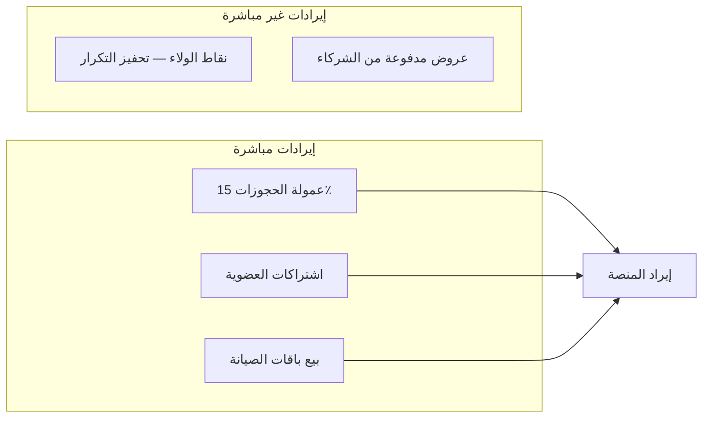

# 04 — نموذج الأعمال والتحقيق من الدخل | Business Monetization

استراتيجية تحقيق الدخل لمنصة **روستو** — عناية ذكية بالسيارات.

---

## مصادر الإيرادات



| المصدر | الوصف | النسبة/السعر |
|--------|-------|--------------|
| عمولة الحجز | نسبة من كل خدمة مكتملة | 15٪ |
| حصة الفني | دفع الفني بعد الخصم | 75٪ |
| اشتراك ذهبي | خصم دائم + أولوية | 29 دينار/شهر |
| اشتراك بلاتيني | خصم أكبر + فحص مجاني | 79 دينار/شهر |
| باقة صيانة | 4 زيارات سنوية | 499 دينار/سنة |
| استبدال نقاط | 100 نقطة = 10 دينار | — |

---

## جداول قاعدة البيانات

| الجدول | الغرض |
|--------|-------|
| `membership_plans` | خطط الاشتراك (مجاني، ذهبي، بلاتيني) |
| `user_memberships` | اشتراك المستخدم النشط |
| `service_packages` | باقات الصيانة |
| `package_items` | خدمات داخل الباقة |
| `loyalty_rewards` | مكافآت قابلة للاستبدال |
| `promotion_redemptions` | سجل استخدام أكواد الخصم |
| `booking_revenue` | تقسيم إيراد كل حجز |

---

## API Endpoints

| Method | Path | الوصف |
|--------|------|-------|
| GET | `/api/v1/monetization/plans` | خطط الاشتراك |
| GET | `/api/v1/monetization/packages` | باقات الصيانة |
| GET | `/api/v1/monetization/rewards` | مكافآت النقاط |
| GET | `/api/v1/me/monetization` | ملخص المحفظة والعضوية |
| POST | `/api/v1/me/membership/subscribe` | الاشتراك في خطة |
| POST | `/api/v1/me/loyalty/redeem` | استبدال نقاط |

### مثال — `GET /api/v1/me/monetization`

```json
{
  "data": {
    "membership": {
      "plan_slug": "free",
      "plan_name_ar": "مجاني",
      "discount_percent": 0,
      "expires_at": null
    },
    "loyalty": {
      "balance": 320,
      "points_per_dinar": 10,
      "redeemable_dinar": 32.0
    },
    "packages_owned": 0,
    "lifetime_savings_sar": 30.0
  }
}
```

---

## منطق التسعير عند الحجز

```
سعر الخدمة
  − خصم العضوية (نسبة الخطة)
  − خصم الكود الترويجي
  − خصم النقاط المستبدلة
  = الإجمالي المدفوع

تقسيم الإيراد:
  عمولة المنصة = الإجمالي × 15٪
  حصة الفني    = الإجمالي × 75٪
  احتياطي      = الإجمالي × 10٪
```

---

## واجهة التطبيق

| الشاشة | العنصر |
|--------|--------|
| العروض | بطاقات خطط الاشتراك + باقات الصيانة |
| العروض | استبدال النقاط (100 نقطة = 10 دينار) |
| الملف الشخصي | شارة العضوية + إجمالي التوفير |
| الحجز | خصم العضوية يظهر في ملخص الفاتورة |

---

## الملفات

```
rousto/backend/database/003_monetization.sql
rousto/backend/api/app/routers/monetization.py
rousto/backend/api/app/monetization.py
rousto/app_flutter/lib/screens/membership_screen.dart
```

---

## التشغيل

```bash
cd rousto/backend && docker compose down -v && docker compose up -d
curl http://localhost:8000/api/v1/monetization/plans
curl -H "X-User-Id: a0000000-0000-4000-8000-000000000001" \
  http://localhost:8000/api/v1/me/monetization
```
