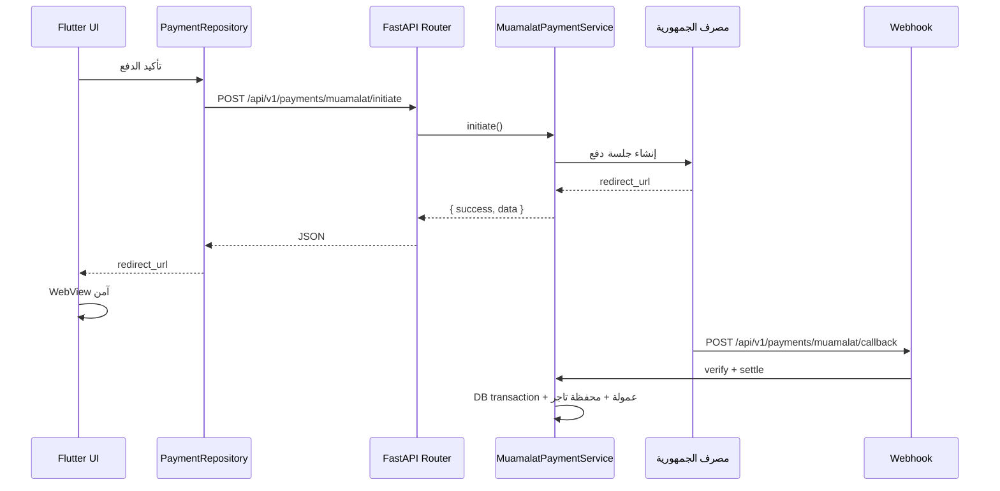

# 41 — الهيكلية المعمارية وتوزيع الـ APIs

وثيقة موحّدة لتوزيع ملفات الـ APIs وتدفق البيانات بين **Backend (FastAPI)**, **لوحات التحكم (Admin HTML/JS)**, و**تطبيق الموبايل (Flutter)**.

> ملاحظة: المشروع الفعلي يستخدم FastAPI + PostgreSQL + Admin HTML/JS + Flutter (وليس Laravel/Next.js). المتطلبات الوظيفية مطابقة للوثيقة الأصلية.

---

## 1. طبقة الباك إند (Backend Layer)

### إعدادات البيئة (`.env`)

مفاتيح البوابات المحلية معزولة في البيئة:

```
MUAMALAT_WEBHOOK_SECRET=...
SADAD_WEBHOOK_SECRET=...
EDFALI_WEBHOOK_SECRET=...
GATEWAY_SANDBOX_MODE=true
PAYMENT_RETURN_URL_BASE=https://pay.rousto.ly
```

### طبقة الخدمات (`app/service_layer/`)

```
app/service_layer/payments/
├── checkout_service.py      # تنسيق الدفع والعمولة
├── wallet_service.py        # محفظة الزبون/التاجر/السائق/المنصة
├── audit_service.py         # تدقيق مالي
├── muamalat_service.py      # بوابة معاملات
├── sadad_service.py         # بوابة سداد
└── edfali_service.py        # بوابة إدفع لي
```

الملفات القديمة (`libyan_payment_services.py`, `wallet_services.py`) تُعيد التصدير للتوافق العكسي.

### طبقة التحكم (`app/routers/`)

- جميع المسارات تحت `/api/v1/...`
- الـ Routers رفيعة — تستدعي Services فقط
- العمليات المالية داخل `db.commit()` بعد معاملات SQLAlchemy

### صيغة JSON الموحدة

```json
// نجاح
{ "success": true, "data": { ... }, "message": "..." }

// قائمة
{ "success": true, "data": [ ... ], "meta": { "total": N } }

// خطأ
{ "success": false, "error": { "code": "...", "message": "..." } }
```

المساعد: `app/api_responses.py` → `success()`, `success_list()`

---

## 2. طبقة الموبايل (Flutter)

```
lib/
├── core/network/
│   └── api_client.dart          # HTTP حصري — baseUrl + JWT
├── features/
│   └── payments/
│       ├── data/repositories/
│       │   └── payment_repository.dart
│       └── presentation/
│           └── checkout_screen.dart
├── api/api_client.dart          # re-export للتوافق
└── screens/checkout_screen.dart # re-export للتوافق
```

**تدفق:** UI → Repository → ApiClient → Backend

---

## 3. لوحات التحكم (Admin HTML/JS)

```
admin/js/services/
├── api-client.js           # RoustoApiClient — fetch موحّد
├── payment-service.js      # مدفوعات الأدمن
└── vendor-wallet-service.js # محفظة التاجر
```

**إعدادات:** `apiBase` + `X-Admin-Key` أو `X-Vendor-Id` في localStorage لكل بوابة.

---

## 4. مخطط تدفق الدفع (معاملات)



### مسارات الدفع

| الخطوة | المسار |
|--------|--------|
| بدء الدفع (عام) | `POST /api/v1/payments/checkout` |
| بدء معاملات | `POST /api/v1/payments/muamalat/initiate` |
| بدء سداد | `POST /api/v1/payments/sadad/initiate` |
| بدء إدفع لي | `POST /api/v1/payments/edfali/initiate` |
| Webhook (جديد) | `POST /api/v1/payments/{gateway}/callback` |
| Webhook (قديم) | `POST /api/v1/webhooks/payments/{gateway}` |

---

## 5. الموديولات الموسّعة (بعد المدفوعات)

| الموديول | Backend | Flutter | Admin |
|----------|---------|---------|-------|
| قطع الغيار | `service_layer/parts/` | `features/parts/` | `parts-service.js` |
| الحجوزات | `service_layer/bookings/` | `features/bookings/` | — |
| الإشعارات | `service_layer/notifications/` | `features/notifications/` | `notifications-service.js` |
| الدعم/التذاكر | `service_layer/support/` | `features/support/` | `support-service.js` |
| التاجر | `service_layer/vendors/` | — | `vendor-parts-service.js` |
| التوافق المركبات | — | `features/fitment/` | — |

`AppRepository` يفوّض الآن إلى `PartsRepository` و `BookingRepository` للحفاظ على التوافق.

---

## 6. مبادئ التنفيذ

1. **عزل المسؤوليات** — Router ≠ Service ≠ Gateway Adapter
2. **معاملات ذرية** — كل تسوية مالية داخل session واحدة
3. **توافق عكسي** — re-exports للمسارات والملفات القديمة
4. **بوابات ليبية فقط** — حظر Stripe/PayPal برمجياً
